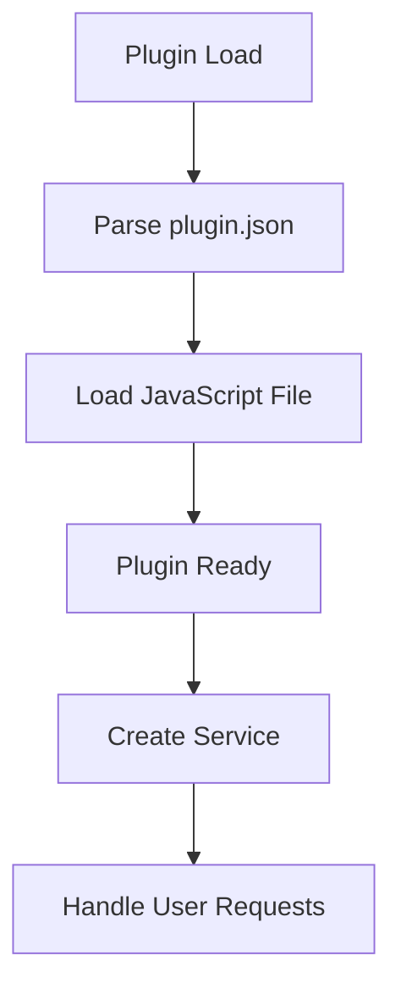
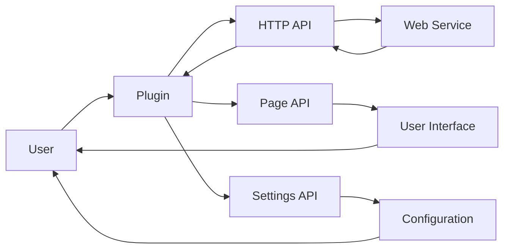

# Plugin Architecture Analysis: LostFilm.TV

## Overview

This document provides an architectural analysis of the plugin located at `D:\movian_stuff\movian\plugin_examples\LostFilm.TV`.

## File Structure

### Essential Files

- **http.js** - Main plugin JavaScript file
- **lostfilm.js** - Main plugin JavaScript file
- **plugin.json** - Plugin configuration and metadata

### Common Files

- **logo.png** - Plugin logo
- **README.md** - Plugin documentation

### Other Files

- .git\config
- .git\description
- .git\HEAD
- .git\hooks\applypatch-msg.sample
- .git\hooks\commit-msg.sample
- .git\hooks\fsmonitor-watchman.sample
- .git\hooks\post-update.sample
- .git\hooks\pre-applypatch.sample
- .git\hooks\pre-commit.sample
- .git\hooks\pre-merge-commit.sample
- .git\hooks\pre-push.sample
- .git\hooks\pre-rebase.sample
- .git\hooks\pre-receive.sample
- .git\hooks\prepare-commit-msg.sample
- .git\hooks\push-to-checkout.sample
- .git\hooks\sendemail-validate.sample
- .git\hooks\update.sample
- .git\index
- .git\info\exclude
- .git\logs\HEAD
- .git\logs\refs\heads\master
- .git\logs\refs\remotes\origin\HEAD
- .git\objects\pack\pack-5ab404f3ef632634fee32da91ab97b1bb5f1fd93.idx
- .git\objects\pack\pack-5ab404f3ef632634fee32da91ab97b1bb5f1fd93.pack
- .git\objects\pack\pack-5ab404f3ef632634fee32da91ab97b1bb5f1fd93.rev
- .git\packed-refs
- .git\refs\heads\master
- .git\refs\remotes\origin\HEAD
- TODO
- views\captchaLogin.view
- views\customImage.view
- views\customString.view
- views\episode.view
- views\in-progress.svg
- views\main.view
- views\serial.view
- views\serial_details.view
- views\watched.svg

## API Usage

This plugin uses the following Movian APIs:

### HTTP API

HTTP requests and web service integration

**Usage count:** 14 occurrences

**Files:** `lostfilm.js`

**Examples:**
```javascript
var http = require("movian/http");
```

```javascript
http.request(url, options);
```

### PAGE API

Page manipulation and content management

**Usage count:** 48 occurrences

**Files:** `lostfilm.js`

**Examples:**
```javascript
page.appendItem(url, "video", metadata);
```

```javascript
page.loading = true;
```

### SETTINGS API

Plugin settings and configuration

**Usage count:** 7 occurrences

**Files:** `lostfilm.js`

**Examples:**
```javascript
var settings = require("movian/settings");
```

```javascript
settings.createBool("enabled", "Enable feature", true);
```

### SERVICE API

Service registration and URI handling

**Usage count:** 1 occurrences

**Files:** `lostfilm.js`

**Examples:**
```javascript
var service = require("movian/service");
```

```javascript
service.create("My Service", "myservice:", logo, true);
```

## Plugin Lifecycle



### Lifecycle Features

- **Initialization function:** No
- **Settings support:** No
- **Service creation:** Yes
- **URI handling:** No

## Data Flow



