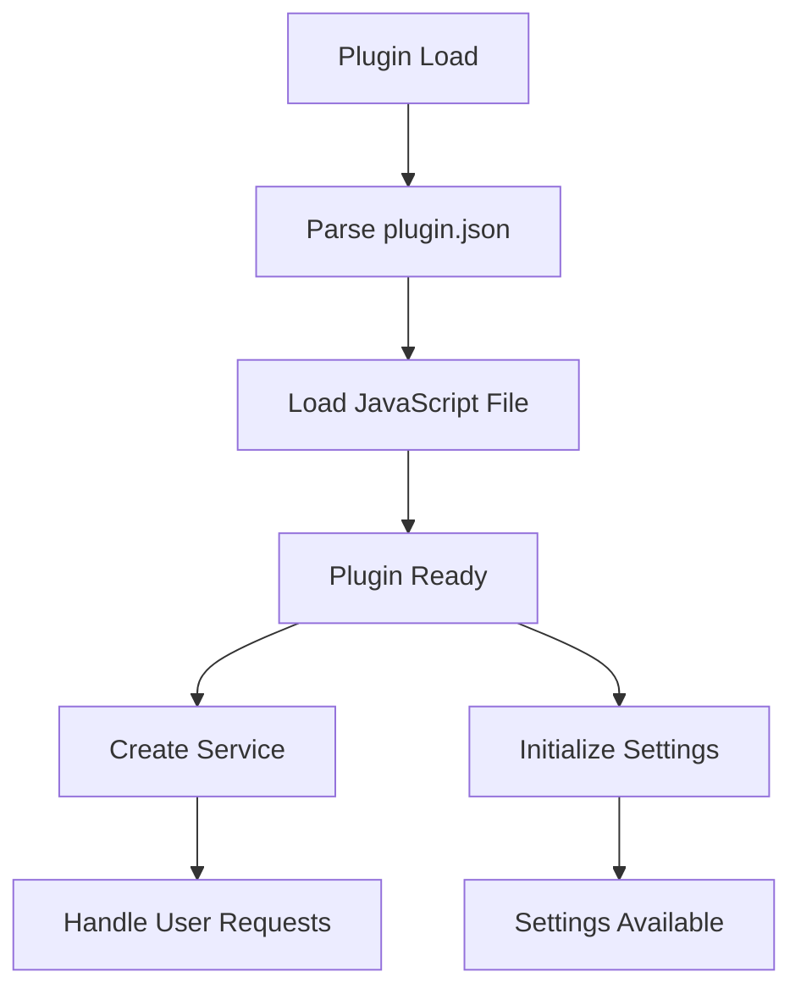
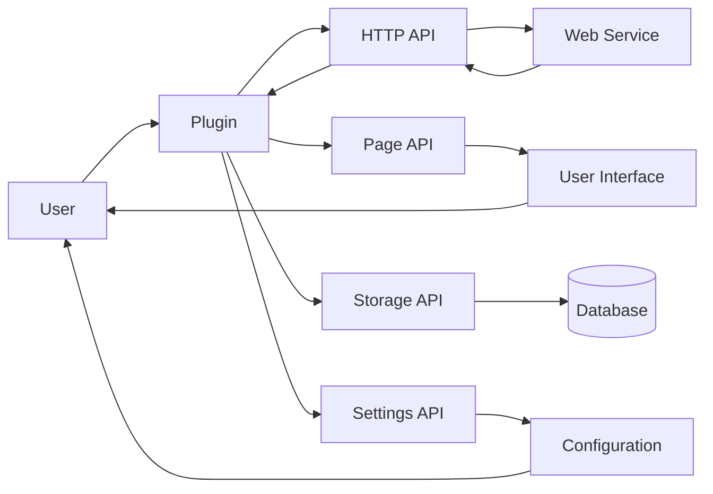

# Plugin Architecture Analysis: _HDRezka

## Overview

This document provides an architectural analysis of the plugin located at `D:\movian_stuff\movian\plugin_examples\_HDRezka`.

## File Structure

### Essential Files

- **HDRezka.js** - Main plugin JavaScript file
- **plugin.json** - Plugin configuration and metadata
- **src\api.js** - Main plugin JavaScript file
- **src\browse.js** - Main plugin JavaScript file
- **src\log.js** - Main plugin JavaScript file
- **src\moviepage.js** - Main plugin JavaScript file
- **utils\atob.js** - Main plugin JavaScript file
- **utils\btoa.js** - Main plugin JavaScript file
- **utils\Dean-Edwards-Unpacker.js** - Main plugin JavaScript file
- **utils\decodeps.js** - Main plugin JavaScript file
- **utils\metadata.js** - Main plugin JavaScript file

### Other Files

- HDRezka.png
- tree.md
- tree.py
- tree.txt

## API Usage

This plugin uses the following Movian APIs:

### HTTP API

HTTP requests and web service integration

**Usage count:** 26 occurrences

**Files:** `HDRezka.js`, `api.js`, `moviepage.js`, `metadata.js`

**Examples:**
```javascript
var http = require("movian/http");
```

```javascript
http.request(url, options);
```

### PAGE API

Page manipulation and content management

**Usage count:** 82 occurrences

**Files:** `HDRezka.js`, `api.js`, `browse.js`, `moviepage.js`

**Examples:**
```javascript
page.appendItem(url, "video", metadata);
```

```javascript
page.loading = true;
```

### SETTINGS API

Plugin settings and configuration

**Usage count:** 8 occurrences

**Files:** `HDRezka.js`

**Examples:**
```javascript
var settings = require("movian/settings");
```

```javascript
settings.createBool("enabled", "Enable feature", true);
```

### SERVICE API

Service registration and URI handling

**Usage count:** 2 occurrences

**Files:** `HDRezka.js`

**Examples:**
```javascript
var service = require("movian/service");
```

```javascript
service.create("My Service", "myservice:", logo, true);
```

### STORAGE API

Data persistence and storage

**Usage count:** 1 occurrences

**Files:** `HDRezka.js`

**Examples:**
```javascript
var store = require("movian/store");
```

```javascript
store.set("key", value);
```

### POPUP API

User notifications and popups

**Usage count:** 2 occurrences

**Files:** `HDRezka.js`

**Examples:**
```javascript
var popup = require("movian/popup");
```

```javascript
popup.notify("Message", 2);
```

## Plugin Lifecycle



### Lifecycle Features

- **Initialization function:** No
- **Settings support:** Yes
- **Service creation:** Yes
- **URI handling:** No

## Data Flow



