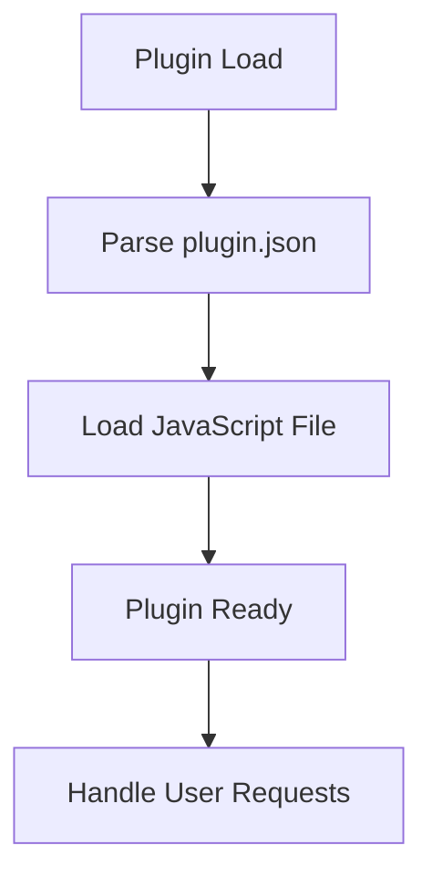

# Plugin Architecture Analysis: dailymotion

## Overview

This document provides an architectural analysis of the plugin located at `D:\movian_stuff\movian\plugin_examples\dailymotion`.

## File Structure

### Essential Files

- **Gruntfile.js** - Main plugin JavaScript file
- **plugin.json** - Plugin configuration and metadata

### Common Files

- **icon.png** - Plugin icon (PNG format recommended)
- **LICENSE** - License file
- **README.md** - Plugin documentation

### Other Files

- .git\config
- .git\description
- .git\HEAD
- .git\hooks\applypatch-msg.sample
- .git\hooks\commit-msg.sample
- .git\hooks\fsmonitor-watchman.sample
- .git\hooks\post-update.sample
- .git\hooks\pre-applypatch.sample
- .git\hooks\pre-commit.sample
- .git\hooks\pre-merge-commit.sample
- .git\hooks\pre-push.sample
- .git\hooks\pre-rebase.sample
- .git\hooks\pre-receive.sample
- .git\hooks\prepare-commit-msg.sample
- .git\hooks\push-to-checkout.sample
- .git\hooks\sendemail-validate.sample
- .git\hooks\update.sample
- .git\index
- .git\info\exclude
- .git\logs\HEAD
- .git\logs\refs\heads\master
- .git\logs\refs\remotes\origin\HEAD
- .git\objects\pack\pack-f5c4f50d9d6e6f6000d76e843b23d036e3c821af.idx
- .git\objects\pack\pack-f5c4f50d9d6e6f6000d76e843b23d036e3c821af.pack
- .git\objects\pack\pack-f5c4f50d9d6e6f6000d76e843b23d036e3c821af.rev
- .git\packed-refs
- .git\refs\heads\master
- .git\refs\remotes\origin\HEAD
- .gitignore
- eslint.json
- package.json
- releases\release_1.0.1.zip
- releases\release_1.0.2.zip
- releases\release_1.0.3.zip
- releases\release_1.0.4.zip
- releases\release_1.0.5.zip
- releases\release_1.0.6.zip
- releases\release_1.0.7.zip
- src\ts\dailymotion.ts
- src\ts\libs\movian\html.d.ts
- src\ts\libs\movian\http.d.ts
- src\ts\libs\movian\page.d.ts
- src\ts\libs\movian\prop.d.ts
- src\ts\libs\movian\service.d.ts
- src\ts\libs\movian\settings.d.ts
- src\ts\libs\movian.d.ts
- src\ts\support\api.ts
- src\ts\support\general.ts
- src\ts\support\http.ts
- src\ts\support\log.ts
- src\ts\support\model.ts
- src\ts\support\playback.ts
- src\ts\support\plugin.ts
- src\ts\support\view.ts
- tsconfig.json

## Plugin Lifecycle

### Lifecycle Features

- **Initialization function:** No
- **Settings support:** No
- **Service creation:** No
- **URI handling:** No

