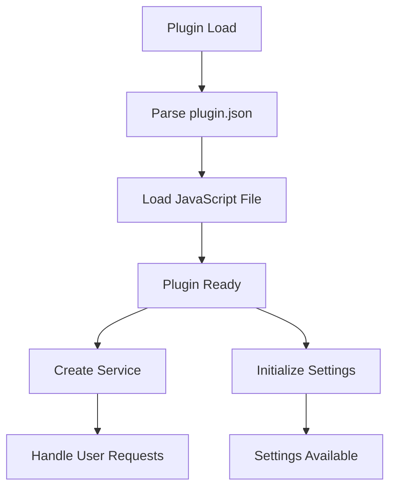
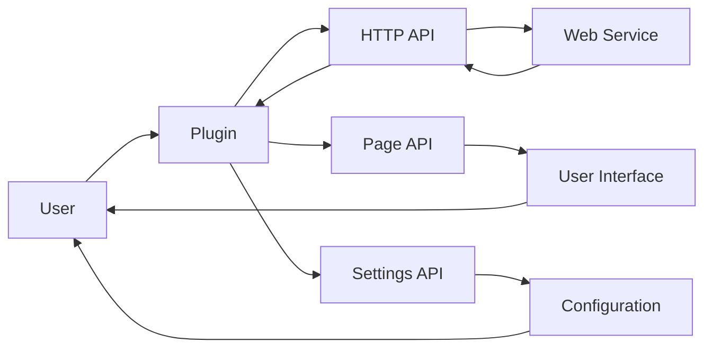

# Plugin Architecture Analysis: movian-plugin-anilibria.tv

## Overview

This document provides an architectural analysis of the plugin located at `D:\movian_stuff\movian\plugin_examples\movian-plugin-anilibria.tv`.

## File Structure

### Essential Files

- **index.js** - Main plugin JavaScript file
- **plugin.json** - Plugin configuration and metadata

### Common Files

- **logo.png** - Plugin logo

## API Usage

This plugin uses the following Movian APIs:

### HTTP API

HTTP requests and web service integration

**Usage count:** 10 occurrences

**Files:** `index.js`

**Examples:**
```javascript
var http = require("movian/http");
```

```javascript
http.request(url, options);
```

### PAGE API

Page manipulation and content management

**Usage count:** 68 occurrences

**Files:** `index.js`

**Examples:**
```javascript
page.appendItem(url, "video", metadata);
```

```javascript
page.loading = true;
```

### SETTINGS API

Plugin settings and configuration

**Usage count:** 5 occurrences

**Files:** `index.js`

**Examples:**
```javascript
var settings = require("movian/settings");
```

```javascript
settings.createBool("enabled", "Enable feature", true);
```

### SERVICE API

Service registration and URI handling

**Usage count:** 2 occurrences

**Files:** `index.js`

**Examples:**
```javascript
var service = require("movian/service");
```

```javascript
service.create("My Service", "myservice:", logo, true);
```

## Plugin Lifecycle



### Lifecycle Features

- **Initialization function:** No
- **Settings support:** Yes
- **Service creation:** Yes
- **URI handling:** No

## Data Flow



