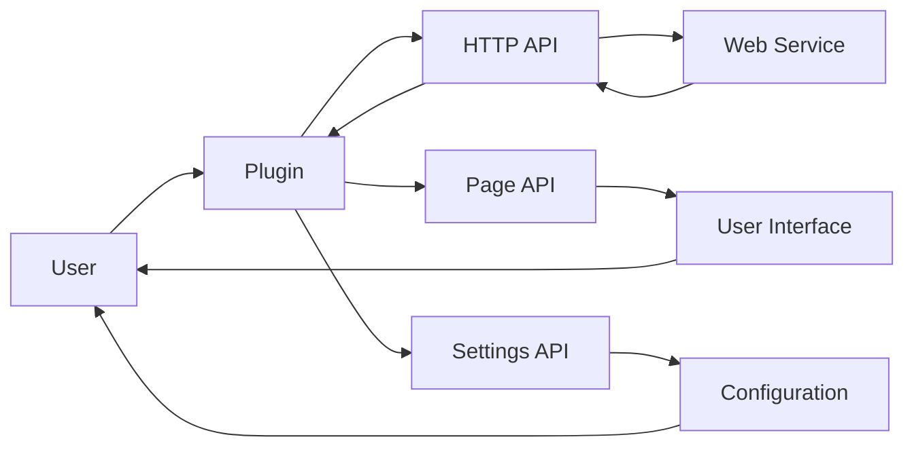

# Plugin Architecture Analysis: movian-plugin-trakt

## Overview

This document provides an architectural analysis of the plugin located at `D:\movian_stuff\movian\plugin_examples\movian-plugin-trakt`.

## File Structure

### Essential Files

- **libs\events\events.js** - Main plugin JavaScript file
- **libs\events\tests\add-listeners.js** - Main plugin JavaScript file
- **libs\events\tests\check-listener-leaks.js** - Main plugin JavaScript file
- **libs\events\tests\common.js** - Main plugin JavaScript file
- **libs\events\tests\index.js** - Main plugin JavaScript file
- **libs\events\tests\legacy-compat.js** - Main plugin JavaScript file
- **libs\events\tests\listener-count.js** - Main plugin JavaScript file
- **libs\events\tests\listeners-side-effects.js** - Main plugin JavaScript file
- **libs\events\tests\listeners.js** - Main plugin JavaScript file
- **libs\events\tests\max-listeners.js** - Main plugin JavaScript file
- **libs\events\tests\modify-in-emit.js** - Main plugin JavaScript file
- **libs\events\tests\num-args.js** - Main plugin JavaScript file
- **libs\events\tests\once.js** - Main plugin JavaScript file
- **libs\events\tests\remove-all-listeners.js** - Main plugin JavaScript file
- **libs\events\tests\remove-listeners.js** - Main plugin JavaScript file
- **libs\events\tests\set-max-listeners-side-effects.js** - Main plugin JavaScript file
- **libs\events\tests\subclass.js** - Main plugin JavaScript file
- **libs\torrent-name-parser\core.js** - Main plugin JavaScript file
- **libs\torrent-name-parser\index.js** - Main plugin JavaScript file
- **libs\torrent-name-parser\parts\common.js** - Main plugin JavaScript file
- **libs\torrent-name-parser\parts\excess.js** - Main plugin JavaScript file
- **libs\torrent-name-parser\parts\title.js** - Main plugin JavaScript file
- **libs\torrent-name-parser\test.js** - Main plugin JavaScript file
- **plugin.json** - Plugin configuration and metadata
- **src\api.js** - Main plugin JavaScript file
- **src\auth.js** - Main plugin JavaScript file
- **src\itemhooks.js** - Main plugin JavaScript file
- **src\log.js** - Main plugin JavaScript file
- **src\lookup.js** - Main plugin JavaScript file
- **src\model.js** - Main plugin JavaScript file
- **src\plugin.js** - Main plugin JavaScript file
- **src\popup.js** - Main plugin JavaScript file
- **src\scrobble.js** - Main plugin JavaScript file
- **src\stacktraceable.js** - Main plugin JavaScript file
- **src\utils.js** - Main plugin JavaScript file
- **src\view.js** - Main plugin JavaScript file
- **trakt.js** - Main plugin JavaScript file

### Common Files

- **logo.png** - Plugin logo

### Other Files

- .git\config
- .git\description
- .git\HEAD
- .git\hooks\applypatch-msg.sample
- .git\hooks\commit-msg.sample
- .git\hooks\fsmonitor-watchman.sample
- .git\hooks\post-update.sample
- .git\hooks\pre-applypatch.sample
- .git\hooks\pre-commit.sample
- .git\hooks\pre-merge-commit.sample
- .git\hooks\pre-push.sample
- .git\hooks\pre-rebase.sample
- .git\hooks\pre-receive.sample
- .git\hooks\prepare-commit-msg.sample
- .git\hooks\push-to-checkout.sample
- .git\hooks\sendemail-validate.sample
- .git\hooks\update.sample
- .git\index
- .git\info\exclude
- .git\logs\HEAD
- .git\logs\refs\heads\master
- .git\logs\refs\remotes\origin\HEAD
- .git\objects\pack\pack-66f52aba504149adb2e09e8f74c711081fb6bdc8.idx
- .git\objects\pack\pack-66f52aba504149adb2e09e8f74c711081fb6bdc8.pack
- .git\objects\pack\pack-66f52aba504149adb2e09e8f74c711081fb6bdc8.rev
- .git\packed-refs
- .git\refs\heads\master
- .git\refs\remotes\origin\HEAD
- libs\events\.gitignore
- libs\events\.travis.yml
- libs\events\.zuul.yml
- libs\events\History.md
- libs\events\LICENSE
- libs\events\package.json
- libs\events\Readme.md
- libs\torrent-name-parser\.gitignore
- libs\torrent-name-parser\.travis.yml
- libs\torrent-name-parser\package.json
- libs\torrent-name-parser\readme.md
- tree.py
- views\common.view
- views\episode.view
- views\episode_landscape.view
- views\episode_portrait.view
- views\img\check.png
- views\img\eye.png
- views\img\fanart_default.png
- views\img\folder.png
- views\img\metacritic.png
- views\img\movie.png
- views\img\pencil.png
- views\img\person.png
- views\img\play.png
- views\img\poster_default.png
- views\img\question.png
- views\img\rated-r.png
- views\img\rt_certified.png
- views\img\rt_fresh.png
- views\img\rt_rotten.png
- views\img\search.png
- views\img\silver_medal.png
- views\img\trakt.png
- views\img\trophy.png
- views\img\tv.png
- views\img\watchlist.png
- views\itemviews\row\action.view
- views\loading.view
- views\media_header.view
- views\media_ratings.view
- views\movie.view
- views\movie_landscape.view
- views\movie_portrait.view
- views\season.view
- views\season_landscape.view
- views\season_portrait.view
- views\show.view
- views\show_landscape.view
- views\show_portrait.view

## API Usage

This plugin uses the following Movian APIs:

### HTTP API

HTTP requests and web service integration

**Usage count:** 5 occurrences

**Files:** `api.js`, `auth.js`, `model.js`

**Examples:**
```javascript
var http = require("movian/http");
```

```javascript
http.request(url, options);
```

### POPUP API

User notifications and popups

**Usage count:** 37 occurrences

**Files:** `auth.js`, `itemhooks.js`, `scrobble.js`, `view.js`

**Examples:**
```javascript
var popup = require("movian/popup");
```

```javascript
popup.notify("Message", 2);
```

### PAGE API

Page manipulation and content management

**Usage count:** 238 occurrences

**Files:** `lookup.js`, `view.js`, `trakt.js`

**Examples:**
```javascript
page.appendItem(url, "video", metadata);
```

```javascript
page.loading = true;
```

### SETTINGS API

Plugin settings and configuration

**Usage count:** 5 occurrences

**Files:** `trakt.js`

**Examples:**
```javascript
var settings = require("movian/settings");
```

```javascript
settings.createBool("enabled", "Enable feature", true);
```

### SERVICE API

Service registration and URI handling

**Usage count:** 1 occurrences

**Files:** `trakt.js`

**Examples:**
```javascript
var service = require("movian/service");
```

```javascript
service.create("My Service", "myservice:", logo, true);
```

## Plugin Lifecycle

```mermaid
graph TD
    A[Plugin Load] --> B[Parse plugin.json]
    B --> C[Load JavaScript File]
    C --> D[Execute init() function]
    D --> E[Plugin Ready]
    E --> F[Create Service]
    F --> H[Handle User Requests]

```

### Lifecycle Features

- **Initialization function:** Yes
- **Settings support:** No
- **Service creation:** Yes
- **URI handling:** No

## Data Flow



