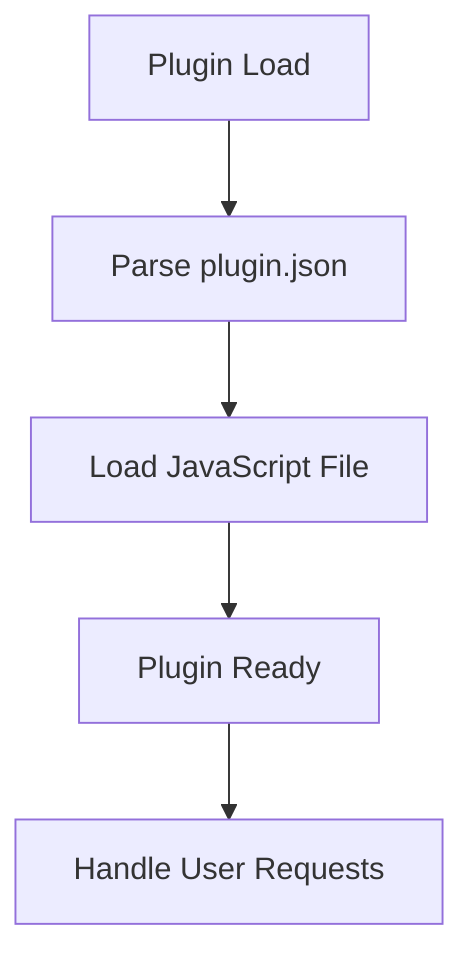
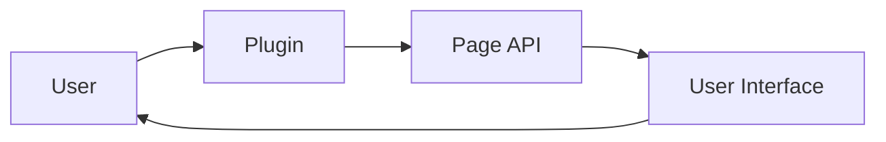

# Plugin Architecture Analysis: music

## Overview

This document provides an architectural analysis of the plugin located at `D:\movian_stuff\movian\plugin_examples\music`.

## File Structure

### Essential Files

- **example_music.js** - Main plugin JavaScript file
- **plugin.json** - Plugin configuration and metadata

## API Usage

This plugin uses the following Movian APIs:

### PAGE API

Page manipulation and content management

**Usage count:** 7 occurrences

**Files:** `example_music.js`

**Examples:**
```javascript
page.appendItem(url, "video", metadata);
```

```javascript
page.loading = true;
```

## Plugin Lifecycle



### Lifecycle Features

- **Initialization function:** No
- **Settings support:** No
- **Service creation:** No
- **URI handling:** No

## Data Flow



