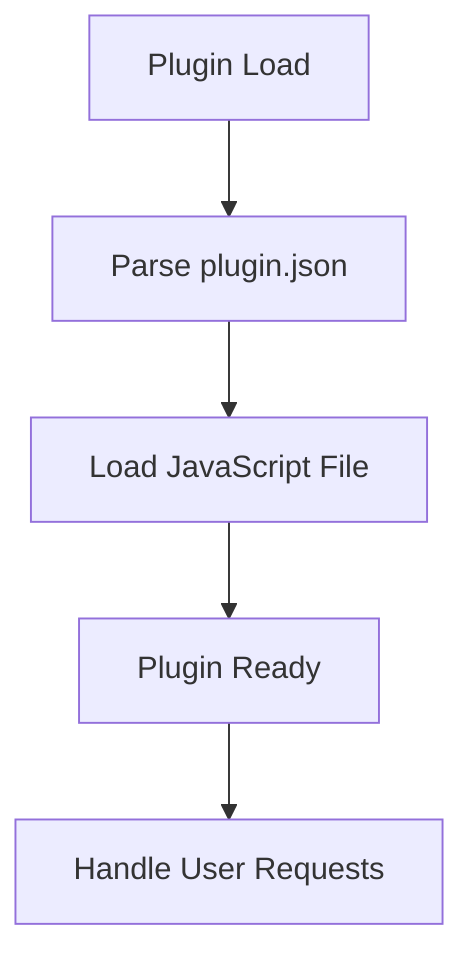

# Plugin Architecture Analysis: oceanus_v1.0.5_ST_ver4.1

## Overview

This document provides an architectural analysis of the plugin located at `D:\movian_stuff\movian\plugin_examples\oceanus_v1.0.5_ST_ver4.1`.

## File Structure

### Essential Files

- **plugin.json** - Plugin configuration and metadata

### Other Files

- CustomSearchResults.zip
- logo.jpg
- searchresults (2).view
- searchresults.view
- tree.md
- tree.py
- tree.txt
- views\array.view
- views\common.view
- views\coverflow.view
- views\fonts\Segoe\segoeuil.ttf
- views\footer.view
- views\header.view
- views\img\array.bmp
- views\img\background.png
- views\img\boxart-overlay-blue.png
- views\img\cdcover_glass_aa.png
- views\img\coverflow.bmp
- views\img\exit.png
- views\img\gradient-blue-hi.png
- views\img\gradient_blue.png
- views\img\gradient_blue_jpg.jpg
- views\img\hd1.png
- views\img\infobar.png
- views\img\infoOverlayTop.bmp
- views\img\infoOverlayTop.png
- views\img\list.bmp
- views\img\list.png
- views\img\loading.gif
- views\img\nophoto.png
- views\img\panel_featured_reflect.png
- views\img\posterdiffuse.bmp
- views\img\posterreflectiondiffuse2.bmp
- views\img\poster_overlay.png
- views\img\poster_shadow.png
- views\img\shadedplate.bmp
- views\img\tile.bmp
- views\itemviews\action.view
- views\itemviews\bodytext.view
- views\itemviews\common.view
- views\itemviews\divider.view
- views\itemviews\img\boxart-overlay-blue.png
- views\itemviews\img\boxart-overlay.png
- views\itemviews\img\tile.png
- views\itemviews\label.view
- views\itemviews\list.view
- views\itemviews\rating.view
- views\list.view
- views\list2.view
- views\listitemviews\rating.view
- views\posters.view
- views\shift.view
- views\videoitemviews\action.view
- views\videoitemviews\bodytext.view
- views\videoitemviews\common.view
- views\videoitemviews\divider.view
- views\videoitemviews\img\boxart-overlay-blue.png
- views\videoitemviews\img\boxart-overlay.png
- views\videoitemviews\img\tile.png
- views\videoitemviews\label.view
- views\videoitemviews\list.view
- views\videoitemviews\rating.view

## Plugin Lifecycle

### Lifecycle Features

- **Initialization function:** No
- **Settings support:** No
- **Service creation:** No
- **URI handling:** No

