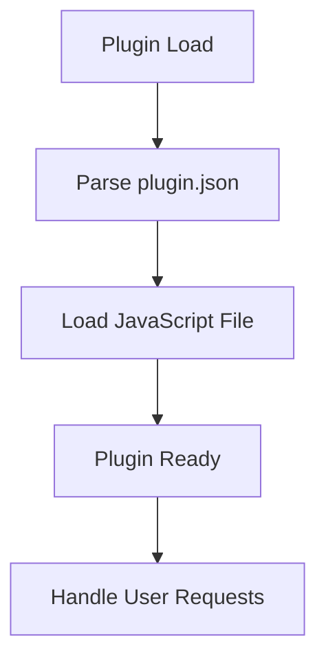

# Plugin Architecture Analysis: opensubtitles

## Overview

This document provides an architectural analysis of the plugin located at `D:\movian_stuff\movian\plugin_examples\opensubtitles`.

## File Structure

### Essential Files

- **opensubtitles.js** - Main plugin JavaScript file
- **plugin.json** - Plugin configuration and metadata

### Other Files

- logo.jpg

## Plugin Lifecycle

### Lifecycle Features

- **Initialization function:** No
- **Settings support:** No
- **Service creation:** No
- **URI handling:** No

