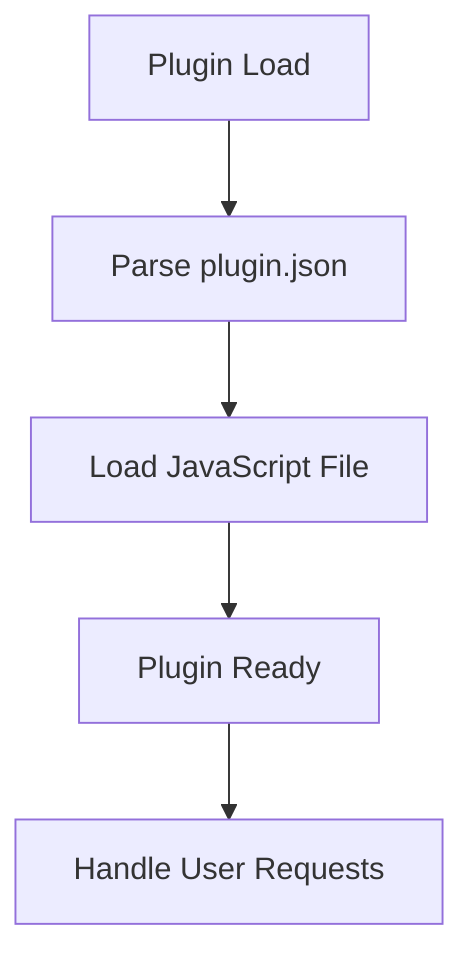
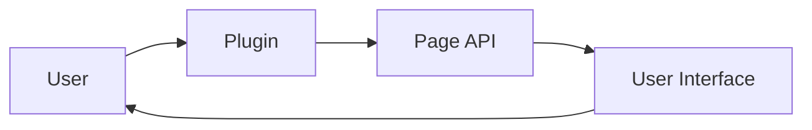

# Plugin Architecture Analysis: soap4.me

## Overview

This document provides an architectural analysis of the plugin located at `D:\movian_stuff\movian\plugin_examples\soap4.me`.

## File Structure

### Essential Files

- **index.js** - Main plugin JavaScript file
- **plugin.json** - Plugin configuration and metadata

### Common Files

- **logo.png** - Plugin logo

## API Usage

This plugin uses the following Movian APIs:

### PAGE API

Page manipulation and content management

**Usage count:** 31 occurrences

**Files:** `index.js`

**Examples:**
```javascript
page.appendItem(url, "video", metadata);
```

```javascript
page.loading = true;
```

## Plugin Lifecycle



### Lifecycle Features

- **Initialization function:** No
- **Settings support:** No
- **Service creation:** No
- **URI handling:** No

## Data Flow



