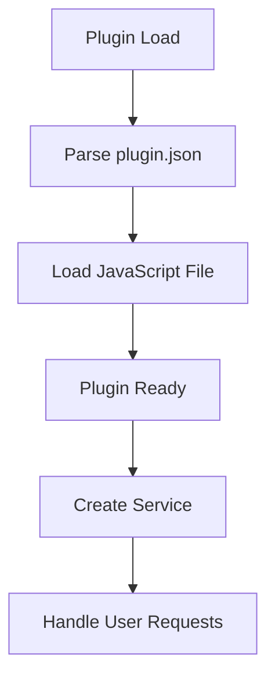
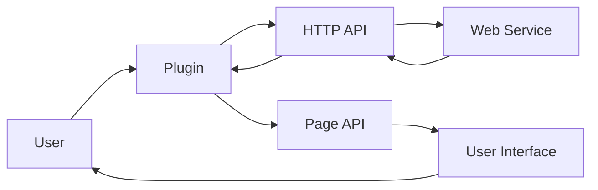

# Plugin Architecture Analysis: theme-manager

## Overview

This document provides an architectural analysis of the plugin located at `D:\movian_stuff\movian\plugin_examples\theme-manager`.

## File Structure

### Essential Files

- **main.js** - Main plugin JavaScript file
- **plugin.json** - Plugin configuration and metadata

### Common Files

- **logo.png** - Plugin logo

## API Usage

This plugin uses the following Movian APIs:

### HTTP API

HTTP requests and web service integration

**Usage count:** 1 occurrences

**Files:** `main.js`

**Examples:**
```javascript
var http = require("movian/http");
```

```javascript
http.request(url, options);
```

### PAGE API

Page manipulation and content management

**Usage count:** 24 occurrences

**Files:** `main.js`

**Examples:**
```javascript
page.appendItem(url, "video", metadata);
```

```javascript
page.loading = true;
```

### SERVICE API

Service registration and URI handling

**Usage count:** 2 occurrences

**Files:** `main.js`

**Examples:**
```javascript
var service = require("movian/service");
```

```javascript
service.create("My Service", "myservice:", logo, true);
```

### POPUP API

User notifications and popups

**Usage count:** 5 occurrences

**Files:** `main.js`

**Examples:**
```javascript
var popup = require("movian/popup");
```

```javascript
popup.notify("Message", 2);
```

## Plugin Lifecycle



### Lifecycle Features

- **Initialization function:** No
- **Settings support:** No
- **Service creation:** Yes
- **URI handling:** No

## Data Flow



