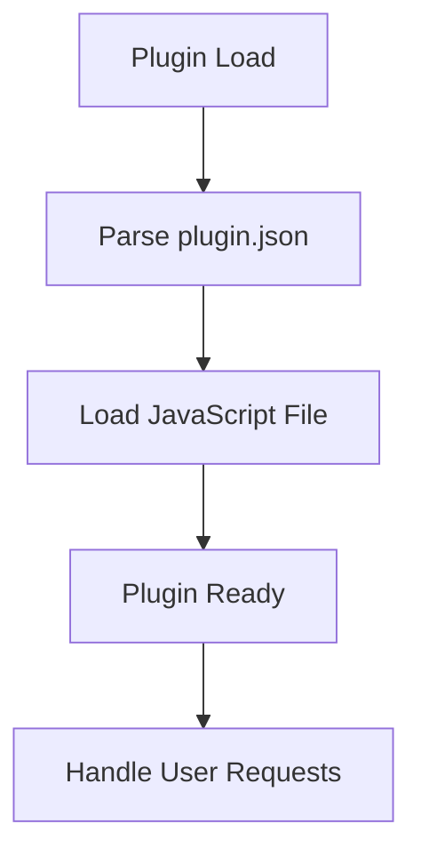
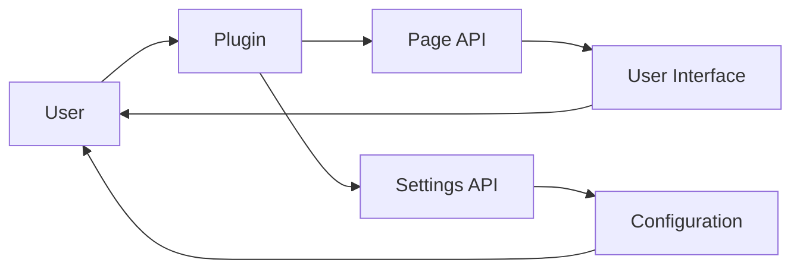

# Plugin Architecture Analysis: tmdb

## Overview

This document provides an architectural analysis of the plugin located at `D:\movian_stuff\movian\plugin_examples\tmdb`.

## File Structure

### Essential Files

- **plugin.json** - Plugin configuration and metadata
- **tmdb.js** - Main plugin JavaScript file

### Common Files

- **LICENSE** - License file
- **logo.png** - Plugin logo

### Other Files

- img\youtube.png
- README.markdown
- views\array.view
- views\auth_1.view
- views\auth_2.view
- views\common.view
- views\fonts\Quattrocento\Quattrocento-Regular.ttf
- views\fonts\Segoe\segoeuil.ttf
- views\genres.view
- views\header.view
- views\img\add.png
- views\img\add_favorite.png
- views\img\add_list.png
- views\img\auth\auth_confirmation.png
- views\img\auth\auth_request.png
- views\img\auth\login.png
- views\img\auth\person.jpg
- views\img\auth\person.png
- views\img\background.png
- views\img\boxart-overlay-blue.png
- views\img\box_gradient.jpg
- views\img\cursor.png
- views\img\heart.png
- views\img\infobar.png
- views\img\list.bmp
- views\img\list.png
- views\img\movie.png
- views\img\nophoto.jpg
- views\img\nophoto.png
- views\img\person.png
- views\img\posterdiffuse.bmp
- views\img\question.png
- views\img\rated-r.png
- views\img\search.png
- views\img\separator.png
- views\img\shadedplate.png
- views\img\tile.png
- views\img\user.png
- views\img\watchlist.png
- views\img\watch_later.png
- views\itemviews\action.view
- views\itemviews\bodytext.view
- views\itemviews\common.view
- views\itemviews\divider.view
- views\itemviews\episode_list.view
- views\itemviews\fonts\Segoe\segoeuil.ttf
- views\itemviews\img\boxart-overlay-blue.png
- views\itemviews\img\boxart-overlay.png
- views\itemviews\img\tile.png
- views\itemviews\kim_rating.view
- views\itemviews\label.view
- views\itemviews\list.view
- views\itemviews\rating.view
- views\itemviews\seasons_list.view
- views\kim_parentsguide.view
- views\lists.view
- views\loading.view
- views\posters.view
- views\reviews.view
- views\text.view
- views\tmdb.view
- views\tvshow.view
- views\user.view

## API Usage

This plugin uses the following Movian APIs:

### PAGE API

Page manipulation and content management

**Usage count:** 280 occurrences

**Files:** `tmdb.js`

**Examples:**
```javascript
page.appendItem(url, "video", metadata);
```

```javascript
page.loading = true;
```

### SETTINGS API

Plugin settings and configuration

**Usage count:** 19 occurrences

**Files:** `tmdb.js`

**Examples:**
```javascript
var settings = require("movian/settings");
```

```javascript
settings.createBool("enabled", "Enable feature", true);
```

## Plugin Lifecycle



### Lifecycle Features

- **Initialization function:** No
- **Settings support:** No
- **Service creation:** No
- **URI handling:** No

## Data Flow



