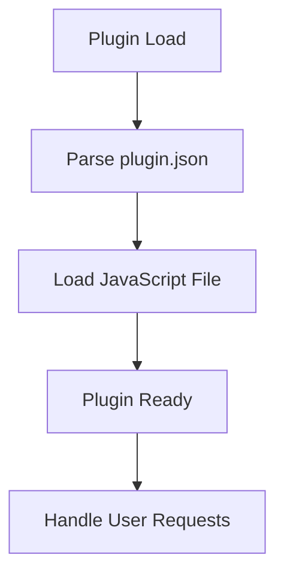
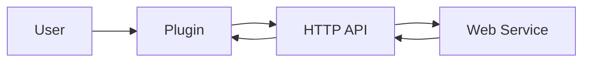

# Plugin Architecture Analysis: webpopupplugin

## Overview

This document provides an architectural analysis of the plugin located at `D:\movian_stuff\movian\plugin_examples\webpopupplugin`.

## File Structure

### Essential Files

- **devplug.js** - Main plugin JavaScript file
- **plugin.json** - Plugin configuration and metadata

## API Usage

This plugin uses the following Movian APIs:

### HTTP API

HTTP requests and web service integration

**Usage count:** 3 occurrences

**Files:** `devplug.js`

**Examples:**
```javascript
var http = require("movian/http");
```

```javascript
http.request(url, options);
```

## Plugin Lifecycle



### Lifecycle Features

- **Initialization function:** No
- **Settings support:** No
- **Service creation:** No
- **URI handling:** No

## Data Flow



