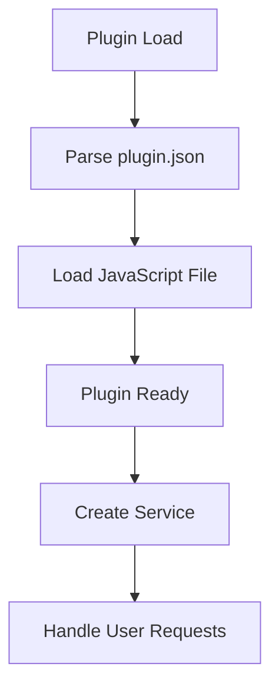
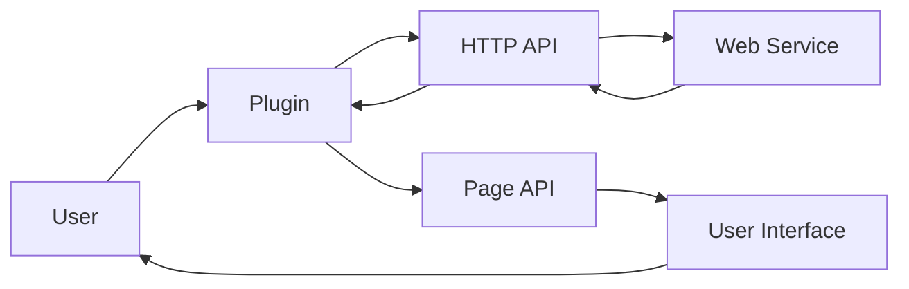

# Plugin Architecture Analysis: youtube

## Overview

This document provides an architectural analysis of the plugin located at `D:\movian_stuff\movian\plugin_examples\youtube`.

## File Structure

### Essential Files

- **api.js** - Main plugin JavaScript file
- **browse.js** - Main plugin JavaScript file
- **plugin.json** - Plugin configuration and metadata
- **support\html-entities.js** - Main plugin JavaScript file
- **support\jstream.js** - Main plugin JavaScript file
- **support\miniget.js** - Main plugin JavaScript file
- **support\path.js** - Main plugin JavaScript file
- **support\sax.js** - Main plugin JavaScript file
- **youtube.js** - Main plugin JavaScript file
- **ytdl-core\lib\cache.js** - Main plugin JavaScript file
- **ytdl-core\lib\format-utils.js** - Main plugin JavaScript file
- **ytdl-core\lib\formats.js** - Main plugin JavaScript file
- **ytdl-core\lib\index.js** - Main plugin JavaScript file
- **ytdl-core\lib\info-extras.js** - Main plugin JavaScript file
- **ytdl-core\lib\info.js** - Main plugin JavaScript file
- **ytdl-core\lib\sig.js** - Main plugin JavaScript file
- **ytdl-core\lib\url-utils.js** - Main plugin JavaScript file
- **ytdl-core\lib\utils.js** - Main plugin JavaScript file

### Common Files

- **logo.png** - Plugin logo
- **README.md** - Plugin documentation

### Other Files

- youtube.svg

## API Usage

This plugin uses the following Movian APIs:

### HTTP API

HTTP requests and web service integration

**Usage count:** 10 occurrences

**Files:** `api.js`, `youtube.js`

**Examples:**
```javascript
var http = require("movian/http");
```

```javascript
http.request(url, options);
```

### PAGE API

Page manipulation and content management

**Usage count:** 93 occurrences

**Files:** `api.js`, `browse.js`, `youtube.js`

**Examples:**
```javascript
page.appendItem(url, "video", metadata);
```

```javascript
page.loading = true;
```

### POPUP API

User notifications and popups

**Usage count:** 9 occurrences

**Files:** `browse.js`, `youtube.js`

**Examples:**
```javascript
var popup = require("movian/popup");
```

```javascript
popup.notify("Message", 2);
```

### SERVICE API

Service registration and URI handling

**Usage count:** 2 occurrences

**Files:** `youtube.js`

**Examples:**
```javascript
var service = require("movian/service");
```

```javascript
service.create("My Service", "myservice:", logo, true);
```

## Plugin Lifecycle



### Lifecycle Features

- **Initialization function:** No
- **Settings support:** No
- **Service creation:** Yes
- **URI handling:** No

## Data Flow



